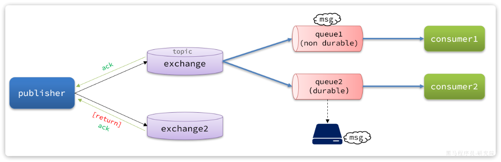

# 生产者的可靠性

消息从生产者出发，有三个丢失点：

```
生产者 ──① 网络抖动，连接 MQ 失败──> MQ
生产者 ──② 到达交换机，但路由不到队列（路由键写错/队列不存在）──> 消息被丢弃
生产者 ──③ 发送代码还没执行，进程就崩了（业务已成功）──> 消息根本没发出去
```

| 丢失点         | 解决手段                                        |
| -------------- | ----------------------------------------------- |
| ① 连接失败     | **生产者重试机制**（template.retry）            |
| ② 路由失败     | **Publisher Return**（交换机退回）+ Confirm ack |
| ② 交换机不存在 | **Publisher Confirm**（nack 回执）              |
| ③ 进程崩溃     | **本地消息表 + 定时补偿**                       |

单靠 Confirm/Return 只能「**感知**」丢失，不能「**挽回**」——感知到之后必须能重新拿到原消息重发，
这就是本地消息表存在的意义。四层手段层层递进，缺一层就有一类丢失兜不住。


## 1. 生产者重试机制

首先第一种情况，就是**生产者发送消息时，出现了网络故障，导致与MQ的连接中断。**

为了解决这个问题，SpringAMQP提供的消息发送时的重试机制。即：当`RabbitTemplate`与MQ连接超时后，多次重试。

修改`publisher`模块的`application.yaml`文件，添加下面的内容：

```yaml
spring:
  rabbitmq:
    connection-timeout: 1s # 设置MQ的连接超时时间
    template:
      retry:
        enabled: true # 开启超时重试机制
        initial-interval: 1000ms # 失败后的初始等待时间
        multiplier: 1 # 失败后下次的等待时长倍数，下次等待时长 = initial-interval * multiplier
        max-attempts: 3 # 最大重试次数
```

**两个必须知道的坑**：

1. > [!IMPORTANT]
   >
   > **这是阻塞式重试**——重试等待期间当前线程被卡住（1s×3 次就是 3 秒）。
   > Tomcat 线程池一共就几十个线程，MQ 宕机时所有发消息的请求都卡住 = 服务雪崩。
   > 生产建议：要么禁用改由本地消息表补偿，要么把发送丢进异步线程。

2. 它只解决「**连接不上**」，消息发出去了但路由失败，重试帮不了你（MQ 会正常接受消息再丢弃）。


## 2. 生产者确认机制

一般情况下，只要生产者与MQ之间的网路连接顺畅，基本不会出现发送消息丢失的情况，因此大多数情况下我们无需考虑这种问题。
不过，在少数情况下，也会出现消息发送到MQ之后丢失的现象，比如：

- MQ内部处理消息的进程发生了异常
- 生产者发送消息到达MQ后未找到`Exchange`
- 生产者发送消息到达MQ的`Exchange`后，未找到合适的`Queue`，因此无法路由

针对上述情况，RabbitMQ提供了生产者消息确认机制，包括`Publisher Confirm`和`Publisher Return`两种。在开启确认机制的情况下，当生产者发送消息给MQ后，MQ会根据消息处理的情况返回不同的**回执**。
具体如图所示：

总结如下：

- 当消息投递到MQ，但是路由失败时，通过**Publisher Return**返回异常信息，同时返回ack的确认信息，代表投递成功（出现的概率极少）
- 临时消息投递到了MQ，并且入队成功，返回ACK，告知投递成功
- 持久消息投递到了MQ，并且入队完成持久化，返回ACK ，告知投递成功
- 其它情况都会返回NACK，告知投递失败

其中`ack`和`nack`属于**Publisher Confirm**机制，`ack`是投递成功；`nack`是投递失败。而`return`则属于**Publisher Return**机制。
默认两种机制都是关闭状态，需要通过配置文件来开启。


**Publisher Confirm** 和 **Publisher Return** 的核心区别在于它们**把守着消息发送过程中的不同阶段**。

在 RabbitMQ 中，一条消息从生产者发出到最终存入队列，必须经过两个节点：

**生产者 (Producer)  ——> 交换机 (Exchange) ——> 队列 (Queue)**

这两个机制就是为了分别监控这两个箭头的流转状态。以下是它们的详细对比：

**核心区别对比表**

| **维度**           | **Publisher Confirm (确认机制)**                             | **Publisher Return (退回机制)**                              |
| ------------------ | ------------------------------------------------------------ | ------------------------------------------------------------ |
| **监控阶段**       | **生产者   ——> 交换机**                                      | **交换机  ——>队列**                                          |
| **核心目的**       | 确认消息是否成功到达了 RabbitMQ 的交换机。                   | 确认到达交换机的消息，是否成功被路由到了队列。               |
| **返回信号**       | **ack** (投递成功) / **nack** (投递失败)                     | **returnedMessage** (将完整的消息体原路退回)                 |
| **触发成功的场景** | 消息完好无损地抵达了指定的 Exchange。                        | 消息根据 RoutingKey 找到了匹配的 Queue。 (成功时不会触发任何回调) |
| **触发失败的场景** | 1. 交换机名称写错/不存在。  2. 网络闪断，根本没连上 MQ 服务器。  3. MQ 内部发生严重异常。 | 1. 路由键 (RoutingKey) 拼写错误。  2. 交换机没有绑定任何队列。 |
| **配置属性**       | `publisher-confirm-type: correlated`                         | `publisher-returns: true`                                    |

**形象比喻（寄快递）**

- **Publisher Confirm（寄件确认）**：

  你把快递包裹交给了**快递中转站（Exchange）**。

  - 中转站收到了，给你盖了个章说“已揽收**`ack`**。
  - 中转站由于某种原因（比如站点倒闭了、你走错门了）拒收你的包裹 **`nack`**。

- **Publisher Return（查无此人退回）**：

  快递中转站（Exchange）已经收下你的包裹了（Confirm 返回了 ack），但是当他们准备把包裹装上发往目的地的货车（Queue）时，发现你写的收件地址（RoutingKey）是个假地址，根本找不到对应的货车。

  - 此时，中转站只能把这个包裹原封不动地退回（Return）给你。

**总结**

因为交换机（Exchange）本身是没有存储消息的能力的，它只负责“转发”。如果只开启 Confirm 机制，遇到路由失败的情况（拿到 ack，但消息被丢弃），消息依然会丢失。

因此，**Confirm 和 Return 必须组合使用**，才能实现发送端 100% 的消息可靠投递保障。


## 3. 实现生产者确认

### 1. 开启（yml）

实现**发布确认**（Publisher Confirm）的核心是**开启 `correlated` 确认模式**，并在发送消息时传入包含全局唯一 ID 的 **`CorrelationData`**，以便在回调中识别具体是哪条消息收到了 Broker 的 ACK/NACK。

`publisher-confirm-type` 支持三种模式：

- `NONE`：关闭确认机制（默认）。
- `CORRELATED`：异步回调，消息关联 `CorrelationData`，推荐生产使用。
- `SIMPLE`：同步等待确认（性能极差，不推荐）。


实现**退回机制**（Publisher Return）的核心是 **开启配置 `mandatory=true`** 并给 `RabbitTemplate` 注册 **`ReturnsCallback`** 监听器。

退回机制要求 Broker 在找不到匹配 Queue 时将消息退回，必须设置 `mandatory: true`，否则未路由的消息会被 MQ 直接静默丢弃

```yaml
spring:
  rabbitmq:
    publisher-confirm-type: correlated  # 异步回调回执（推荐；none=关闭，simple=同步阻塞）
    publisher-returns: true             # 开启路由失败退回
    template:
      #核心参数：必须设为true，路由失购时才会触发ReturnsCallback；若为false，MQ会直接丢弃该消息
      mandatory: true
```


### 2. 退回机制（return）

#### 全局 ReturnsCallback

每个 RabbitTemplate 只能设一个 ReturnsCallback（一次配置，处处生效），放配置类统一设置

```java
@Configuration
@Slf4j
public class RabbitReturnConfig {
    @Autowired
    private CompensationService compensationService; // 注入你的业务补偿服务
    @Bean
    public RabbitTemplate rabbitTemplate(ConnectionFactory connectionFactory) {
        RabbitTemplate rabbitTemplate = new RabbitTemplate(connectionFactory);
        // 1. 确保 mandatory 属性开启
        rabbitTemplate.setMandatory(true);
        // 2. 注册全局退回监听器
        rabbitTemplate.setReturnsCallback(returned -> {
            // 解析退回数据
            log.error("【MQ消息路由失败】交换机={}, 路由键={}, 应答码={}, 应答文本={}, 消息={}",
                    returned.getExchange(), returned.getRoutingKey(),
                    returned.getReplyCode(), returned.getReplyText(),
                    new String(returned.getMessage().getBody()));
            // 从 MessageProperties 的 Header 中提取发送时注入的全局消息 ID
            String messageId = returned.getMessage()
                    .getMessageProperties()
                    .getHeader("spring_returned_message_correlation");
            // 3. 执行异步业务补偿逻辑（修改本地消息表/发送钉钉告警）
            compensationService.handleRouteFailure(messageId, replyText);
        });
        return rabbitTemplate;
    }
}	
```

在发送消息时，把业务主键或消息 ID 注入到 Header 中，确保回调时能够定位是哪条记录路由失败：

```java
@Service
public class OrderPublisher {
    @Autowired
    private RabbitTemplate rabbitTemplate;
    public void sendOrder(String orderId, Object orderData) {
        // 构建消息处理：将 orderId 设置到 Message Header 中，供 ReturnsCallback 读取
        MessagePostProcessor messagePostProcessor = message -> {
            message.getMessageProperties().setHeader("spring_returned_message_correlation", orderId);
            return message;
        };

        // 发送消息
        rabbitTemplate.convertAndSend(
                "order.exchange",
                "order.created.invalid_key", // 故意拼错的 RoutingKey 用来测试退回机制
                orderData,
                messagePostProcessor
        );
    }
}
```

**核心注意事项**

- **【先看这条】发送时带了 CorrelationData 就不用手动注入头！** Spring AMQP 在发送时会自动把
  `cd.getId()` 写进 `spring_returned_message_correlation` 头，Return 回调直接读即可。
  上面 `MessagePostProcessor` 手动 setHeader 的写法，只适用于「不带 CorrelationData 发送」的场景。
  由于 Confirm 闭环本来就要求携带 cd（§3.3.2），生产上统一走 cd 即可，手动注入是冗余代码。
- **`mandatory` 参数必传**：如果不配置 `spring.rabbitmq.template.mandatory=true`，即便写了 `ReturnsCallback` 代码，路由失败时也**永远不会被触发**。
- **唯一性约束**：每一个 `RabbitTemplate` 实例只能注册**一个** `ReturnsCallback`。如果项目中多处设置，后设置的会覆盖前面的。
- **异步线程隔离**：`ReturnsCallback` 的回调方法是在 RabbitMQ 的 NIO 监听线程中执行的，**千万不要在回调函数内做同步阻塞操作**（如大 SQL 查询、远程 HTTP 调用），必须通过 `@Async` 或自建线程池异步处理补偿逻辑。


### 3. 确认机制（confirm）

#### 1. 全局 ConfirmCallback

在 `RabbitTemplate` 配置类里面中注册发布确认回调监听器：

```java
@Configuration
@Slf4j
public class RabbitConfirmConfig {
    @Autowired
    private CompensationService compensationService; // 注入业务补偿服务
    @Bean
    public RabbitTemplate rabbitTemplate(ConnectionFactory connectionFactory) {
        RabbitTemplate rabbitTemplate = new RabbitTemplate(connectionFactory);
        // 设置发布确认回调
        rabbitTemplate.setConfirmCallback((correlationData, ack, cause) -> {
            // 获取发送时传入的唯一消息 ID
            String messageId = correlationData != null ? correlationData.getId() : "UNKNOWN";
            if (ack) {
                log.info("【MQ发布确认】消息成功送达 Exchange, MessageId: {}", messageId);
                // 可在此处将本地消息表状态修改为 SUCCESS（发送成功）
                compensationService.updateStatusToSuccess(messageId);
            } else {
                log.error("【MQ发布确认失败】消息未能送达 Exchange, MessageId: {}, 原因: {}", messageId, cause);
                // 触发失败补偿逻辑（如重试或标记为待重试状态）
                compensationService.handleSendFailure(messageId, cause);
            }
        });
        return rabbitTemplate;
    }
}
```

发送消息时，**必须构建并传入 `CorrelationData`**。如果未传该参数，当回调发生时 `correlationData` 将为 `null`，导致无法追踪具体是哪条消息成功或失败：

```java
@Service
public class OrderPublisher {
    @Autowired
    private RabbitTemplate rabbitTemplate;
    public void sendOrderMessage(String orderId, Object orderData) {
        // 1. 使用业务主键或全局唯一 ID 创建 CorrelationData
        CorrelationData correlationData = new CorrelationData(orderId);
        // 2. 发送消息时，将 correlationData 作为最后一个参数传入
        rabbitTemplate.convertAndSend(
                "order.exchange",
                "order.created",
                orderData,
                correlationData
        );
    }
}
```


#### 2. 局部 ConfirmCallback

**生产环境推荐使用“局部确认”（基于 `CorrelationData` 的 Future 回调）**

Confirm 回调跟随消息走，所以**每次发送时**通过 `CorrelationData` 定制

```java
// 1. 创建 CorrelationData（用业务 ID 或消息 ID 标识）
CorrelationData cd = new CorrelationData(messageId);

// 2. 挂载回调
cd.getFuture().whenComplete((confirm, ex) -> {
    // 处理连接异常或 Channel 关闭引发的 Future 异常
    if (ex != null) {
        log.error("[Confirm] 发送异常，messageId={}", messageId, ex);
        updateStatus(messageId, 2); // 标记失败，等待定时任务补偿
        return;
    }

    // 处理 Broker 的 Ack / Nack 响应
    if (confirm != null && confirm.isAck()) {
        updateStatus(messageId, 1); // ACK -> 成功确认
    } else {
        String reason = (confirm != null) ? confirm.getReason() : "未知原因";
        log.error("[Confirm] NACK 拒绝接收，messageId={}, reason={}", messageId, reason);
        updateStatus(messageId, 2); // NACK -> 失败，等待补偿
    }
});

// 3. 必须携带 cd 发送消息
rabbitTemplate.convertAndSend(exchange, routingKey, payload, cd);
```

**三个高频踩坑**

1. **不带 cd 发送 = 回调永远不触发**。`convertAndSend(exchange, key, msg)` 三参重载没有回执通道，MQ 回了 nack 你也收不到——「配置全对却毫无反应」基本都是这个原因。
2. **onSuccess ≠ 发送成功**。回调进 onSuccess 只代表「MQ 给了回执」，要看 `result.isAck()`才知道是 ack 还是 nack。
3. cd 的 **id 必须 = 本地消息表的 messageId**，否则回执到达时无法定位要更新的记录，Confirm 机制和业务就断链了。


### 4. 最佳实践方案

为了既保留“局部确认”的灵活性，又避免在业务代码里重复编写冗长的 Future 回调，确认机制建议**封装统一的发送工具类**：

```java
@Component
@Slf4j
public class ReliableMqPublisher {
    @Autowired
    private RabbitTemplate rabbitTemplate;

    /**
     * 发送可靠消息（带局部确认回调）
     */
    public void send(String exchange, String routingKey, Object payload, String messageId, Consumer<Boolean> callback) {
        CorrelationData cd = new CorrelationData(messageId);
        
        // 局部挂载 Confirm 处理
        cd.getFuture().whenComplete((confirm, ex) -> {
            boolean isSuccess = (ex == null && confirm != null && confirm.isAck());
            if (!isSuccess) {
                log.error("[MQ Confirm] 消息投递失败, messageId={}, reason={}", 
                        messageId, ex != null ? ex.getMessage() : confirm.getReason());
            }
            // 执行调用方传入的特定业务逻辑（如更新本地消息表状态）
            if (callback != null) {
                callback.accept(isSuccess);
            }
        });

        rabbitTemplate.convertAndSend(exchange, routingKey, payload, cd);
    }
}
```

**配置建议总结**：

- **ConfirmCallback（送达 Broker 确认）**：写**局部**（或通过工具类封装局部）。
- **ReturnCallback（交换机路由失败退回）**：写**全局**（因为路由失败通常是 Exchange/RoutingKey 配置错误或队列不存在，属于系统级异常，适合全局打日志告警）。


## 4. 本地消息表

**Confirm/Return 解决不了的三个场景**：

- ack 在网络中丢了（MQ 其实收到了，你却以为失败）
- 消息还没发出去进程就崩了（业务已提交）
- 补偿逻辑该重发哪条消息、重发几次、从哪拿原消息？

本地消息表是解决 **“数据库操作 + 发送 MQ 消息” 分布式事务**的最佳实践，核心原则是：**利用本地数据库事务保证“业务数据”与“消息记录”的原子性落盘，再通过异步/定时补偿机制保证消息最终投递成功。**

### 1. 数据库表设计

```sql
CREATE TABLE IF NOT EXISTS local_message (
  id BIGINT AUTO_INCREMENT PRIMARY KEY,
  message_id     VARCHAR(64) NOT NULL COMMENT '消息唯一标识(=CorrelationData.id)',
  message_type   VARCHAR(32) COMMENT 'PAY_SUCCESS...便于按类型定制重发',
  content        TEXT        COMMENT '消息体JSON(与发到MQ的内容一字不差)',
  exchange       VARCHAR(64),
  routing_key    VARCHAR(64),
  status         TINYINT DEFAULT 0 COMMENT '0发送中 1已确认 2失败 3死信',
  retry_count    INT DEFAULT 0,
  create_time    DATETIME,
  next_retry_time DATETIME  COMMENT '下次允许重试时间(指数退避)',
  UNIQUE KEY uk_message_id (message_id),
  KEY idx_status_next_retry (status, next_retry_time)
) ENGINE=InnoDB DEFAULT CHARSET=utf8mb4;
```

索引两把刀：`uk_message_id` 防同一条消息重复落库；`idx_status_next_retry` 给补偿任务扫描用。


### 2. 核心流程

```
@Transactional
public PaySuccessMessage pay(...) {
    1. 扣款等本地业务
    2. reliableMqSender.saveMessage(...)   ← 同一事务内 INSERT local_message (status=SENDING)
    3. reliableMqSender.sendAfterCommit(...)  ← 注册钩子，事务提交后自动发送
}

sendAfterCommit 内部：
    TransactionSynchronizationManager.registerSynchronization(new TransactionSynchronization() {
        @Override public void afterCommit() { send(...); }   // 提交成功才发
    });
```

**两个事务细节决定成败**：

1. **为什么 saveMessage 必须在业务事务内？**
   保证「钱扣了，消息记录一定在」或「钱没扣，记录也没留」——原子性。
   这是比 Confirm 更底层的兜底：进程崩溃后记录还在，补偿任务就能捞起重发。
2. **为什么发送必须在事务提交后（afterCommit）？**
   如果在事务内直接发，事务最终回滚了，消费者会收到一条「业务根本没发生」的**幽灵消息**。
   先落库、后发送的顺序不能反。


### 3. Confirm 闭环 + 定时补偿

```java
public boolean retrySend(LocalMessage msg) {
    if (msg.getRetryCount() >= 3) {
        msg.setStatus(3);                       // 重试耗尽 -> DEAD，转人工
        localMessageMapper.updateById(msg);
        return false;
    }
    // 把库里的 JSON 还原成对象再发（保证与原消息一致）
    Object payload = objectMapper.readValue(msg.getContent(), Object.class);
    reliableMqSender.send(msg.getMessageId(), msg.getExchange(), msg.getRoutingKey(), payload);
    msg.setRetryCount(msg.getRetryCount() + 1);
    long backoff = 30_000L * (1L << msg.getRetryCount());          // 指数退避 30s/60s/120s
    msg.setNextRetryTime(LocalDateTime.now().plusNanos(backoff * 1_000_000));
    localMessageMapper.updateById(msg);
    return true;
}

// 每 30 秒扫一次（生产 1~5 分钟）
@Scheduled(fixedDelay = 30_000)
public void compensate() {
    // status IN (SENDING, FAIL) AND next_retry_time < now
    findTimeoutUnconfirmed().forEach(payService::retrySend);
}
```

状态机全景：`0 SENDING --ack--> 1 CONFIRMED`（终点）
`0/2 --nack/超时--> 补偿重发(最多3次,30s×2ⁿ) --耗尽--> 3 DEAD 转人工`。

**必须想通的一点——补偿必然导致重复投递**：你无法区分「MQ 没收到」和「MQ 收到了但 ack 丢了」，所以补偿任务会盲目重发。**发送端「至少一次」+ 消费端幂等 = 业务上「恰好一次」**，这两层是配套工程，
