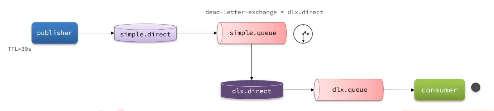

# 延迟消息

**延迟消息：生产者发送消息时指定一个时间，消费者不会立刻收到消息，而是在指定消息之后才收到消息**

**延迟任务：设置在一定时间之后才执行的任务**

在电商的支付业务中，对于一些库存有限的商品，为了更好的用户体验，通常都会在用户下单时立刻扣减商品库存。例如电影院购票、高铁购票，下单后就会锁定座位资源，其他人无法重复购买。

但是这样就存在一个问题，假如用户下单后一直不付款，就会一直占有库存资源，导致其他客户无法正常交易，最终导致商户利益受损！

因此，电商中通常的做法就是：**对于超过一定时间未支付的订单，应该立刻取消订单并释放占用的库存**。

例如，订单支付超时时间为30分钟，则我们应该在用户下单后的第30分钟检查订单支付状态，如果发现未支付，应该立刻取消订单，释放库存。

但问题来了：如何才能准确的实现在下单后第30分钟去检查支付状态呢？

像这种在一段时间以后才执行的任务，我们称之为**延迟任务**，而要实现延迟任务，最简单的方案就是利用MQ的延迟消息了。

在RabbitMQ中实现延迟消息也有两种方案：

- 死信交换机+TTL
- 延迟消息插件


## 1. 死信交换机

什么是死信？

当一个队列中的消息满足下列情况之一时，可以成为死信（dead letter）：

- 消费者使用`basic.reject`或 `basic.nack`声明消费失败，并且消息的`requeue`参数设置为false
- 消息是一个过期消息，超时无人消费
- 要投递的队列消息满了，无法投递

如果一个队列中的消息已经成为死信，并且这个队列通过`dead-letter-exchange`属性指定了一个交换机，那么队列中的死信就会投递到这个交换机中，而这个交换机就称为**死信交换机**（Dead Letter Exchange）。而此时加入有队列与死信交换机绑定，则最终死信就会被投递到这个队列中。

死信交换机有什么作用呢？

1. 收集那些因处理失败而被拒绝的消息
2. 收集那些因队列满了而被拒绝的消息
3. 收集因TTL（有效期）到期的消息


前面两种作用场景可以看做是把死信交换机当做一种消息处理的最终兜底方案，与消费者重试时讲的`RepublishMessageRecoverer`作用类似。

而最后一种场景，大家设想一下这样的场景：


**注意：**
RabbitMQ的消息过期是基于追溯方式来实现的，也就是说当一个消息的TTL到期以后不一定会被移除或投递到死信交换机，而是在消息恰好处于队首时才会被处理。
当队列中消息堆积很多的时候，过期消息可能不会被按时处理，因此你设置的TTL时间不一定准确。


## 2. DelayExchange插件

正常情况下，RabbitMQ 的交换机（Exchange）是不存储消息的，它只负责路由。 但安装了该插件后，会新增一种交换机类型：`x-delayed-message`。

1. **暂存消息：** 当生产者发送带有延迟时间标记的消息到该交换机时，交换机**不会立即路由**，而是将消息暂存在 RabbitMQ 的内部数据库（Mnesia）中。
2. **到期路由：** 交换机会在内部启动定时器，当消息的延迟时间到达后，交换机才会根据 Routing Key 将消息投递到绑定的目标队列中。
3. **消费：** 消费者在目标队列中监听并正常消费消息。


### 1. 部署

**第一阶段：准备插件文件**

1. 根据你的 RabbitMQ 版本（如 `3.12`），去官方 GitHub 发布页下载对应的 `.ez` 格式插件包（例如：`rabbitmq_delayed_message_exchange-3.12.0.ez`）。插件下载地址：[GitHub - rabbitmq/rabbitmq-delayed-message-exchange: Delayed Messaging for RabbitMQ](https://github.com/rabbitmq/rabbitmq-delayed-message-exchange)
2. 先将文件下载到你的物理机（Windows）电脑上。

**第二阶段：Windows -> Linux 虚拟机**

1. 打开你常用的 SSH 客户端工具（如 FinalShell、Xftp、MobaXterm 等），连接到你的 Linux 虚拟机。
2. 将 Windows 上的 `.ez` 文件拖拽或上传到虚拟机内部的某个目录下（例如上传到 `/root` 目录）。

**第三阶段：Linux 虚拟机 -> Docker 容器**

1. 在虚拟机的 SSH 终端里，使用 `cd` 命令切换到你刚才存放文件的目录。

2. 执行 `docker cp` 命令，将宿主机上的文件强行拷贝到 RabbitMQ 容器的官方插件目录中：

   ```bash
   docker cp rabbitmq_delayed_message_exchange-3.12.0.ez rabbitmq:/plugins
   ```

   *(注：命令中的 `rabbitmq` 是你的容器名称，`/plugins` 是容器内的目标路径)*

**第四阶段：激活与重启**

1. 在虚拟机终端里，通过 `docker exec` 进入容器内部执行开启插件的命令：

   ```bash
   docker exec -it rabbitmq rabbitmq-plugins enable rabbitmq_delayed_message_exchange
   ```

2. 重启该容器，让配置彻底加载并生效：

   ```bash
   docker restart rabbitmq
   ```

   *(注：只要执行过一次 enable，配置就会自启动，后续重启虚拟机或容器都不需要再重新配置)*

**第五阶段：最终验证**

1. 在 Windows 浏览器中打开 RabbitMQ 管理后台（[http://192.168.146.130:15672](http://192.168.146.130:15672)）。
2. 点击 **Exchanges** 标签页，展开底部的 **Add a new exchange** 面板。
3. 点击 **Type** 旁边的下拉菜单，如果列表里出现了 **`x-delayed-message`** 选项，即代表部署圆满成功。


### 2. 声明延迟交换机

基于注解方式：

```java
@RabbitListener(bindings = @QueueBinding(
        value = @Queue(name = "delay.queue", durable = "true"),
        exchange = @Exchange(name = "delay.direct", delayed = "true"),
        key = "delay"
))
public void listenDelayMessage(String msg){
    log.info("接收到delay.queue的延迟消息：{}", msg);
}
```

基于`@Bean`的方式：

```java
@Slf4j
@Configuration
public class DelayExchangeConfig {

    @Bean
    public DirectExchange delayExchange(){
        return ExchangeBuilder
                .directExchange("delay.direct") // 指定交换机类型和名称
                .delayed() // 设置delay的属性为true
                .durable(true) // 持久化
                .build();
    }

    @Bean
    public Queue delayedQueue(){
        return new Queue("delay.queue");
    }
    
    @Bean
    public Binding delayQueueBinding(){
        return BindingBuilder.bind(delayedQueue()).to(delayExchange()).with("delay").noargs();
    }
}

```


### 3. 发送延迟消息

发送消息时，必须通过x-delay属性设定延迟时间：

```java
@Test
void testPublisherDelayMessage() {
    // 1.创建消息
    String message = "hello, delayed message";
    // 2.发送消息，利用消息后置处理器添加消息头
    rabbitTemplate.convertAndSend("delay.direct", "delay", message, msg -> {
    // 依然使用 Spring 提供的便捷方法
    msg.getMessageProperties().setHeader("x-delay", delayMillis);
    return msg;
});
}
```
